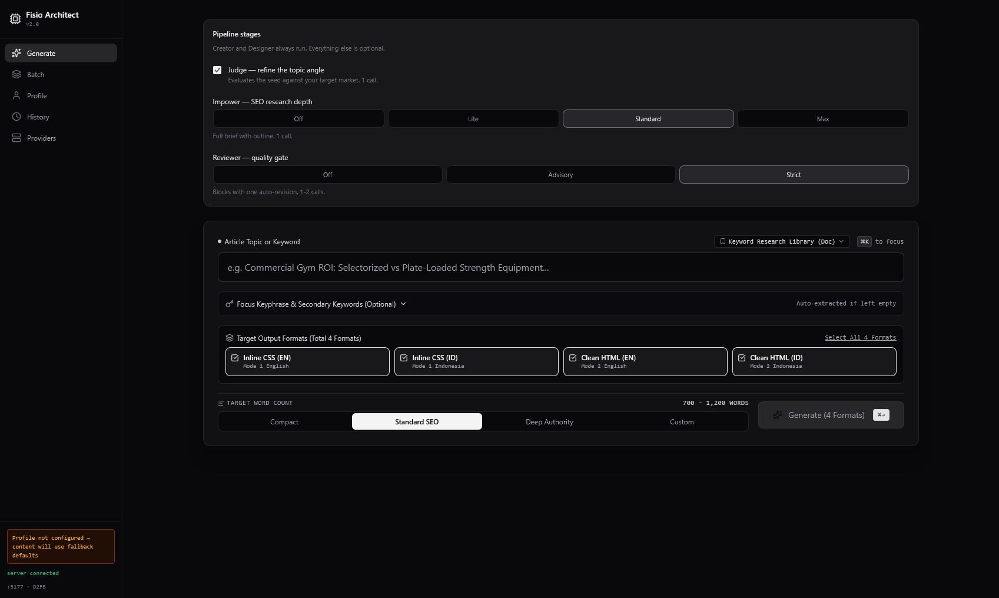

# Fisio Architect 2.0



A local-first, multi-agent **SEO article generator** for B2B commercial-fitness content. It
turns a seed topic into publish-ready, brand-styled HTML through a configurable pipeline of LLM
agents — Judge → Impower → Creator → Reviewer → Designer — with per-role provider routing, batch
generation from CSV, a sandboxed live preview, and IndexedDB history.

Everything runs locally: an Express + Vite server, a browser SPA, and your own LLM provider —
including **free local inference via Ollama**.

---

## Highlights

- **Configurable cost vs. quality pipeline** — turn Judge/Impower/Reviewer on or off; the floor
  (everything off, one format) is exactly **2 provider calls** (Creator + Designer).
- **Strict review gate with recovery** — a failing Reviewer forces one automatic Creator revision,
  then halts. The halted draft stays readable/copyable, with **Retry Creator** / **Skip to Designer**
  actions to resume without re-running the whole pipeline.
- **Five routed views** (hash router): Generate, Batch, Profile, History, Providers.
- **Per-role provider config, auto-saved** — each field persists the moment you edit it.
- **Local & cloud providers**: Google Gemini, OpenAI-compatible, Anthropic, and **Ollama (no key,
  free)**.
- **Batch generation** from CSV with a worker pool (concurrency 1–3), pause / cancel / per-row retry,
  and queue persistence across reloads.
- **Sandboxed HTML preview** in an opaque-origin iframe (agent output cannot touch app storage),
  with brand-token enforcement and an off-palette warning.
- **Export** a single article or a whole batch as a ZIP (per-article folders with every HTML format,
  metadata, Markdown, and the review report).
- **Local-first storage**: articles and jobs in IndexedDB; small settings in `localStorage`.

---

## Tech stack

| Layer | Choice |
|---|---|
| UI | React 19, TypeScript, Tailwind CSS v4, `lucide-react`, `motion` |
| Build / dev | Vite 8 (`@vitejs/plugin-react`), `tsx` |
| Server | Express 4 (serves the Vite dev middleware and the API) |
| AI SDKs | `@google/genai` + plain `fetch` (OpenAI / Anthropic / Ollama) |
| Persistence | `idb-keyval`-era hand-rolled IndexedDB (`src/db`), `localStorage` |
| Export | `jszip` |
| Tests | Vitest (159 tests / 12 files), `fake-indexeddb` |

Node typescript is checked with `tsc --noEmit` (the `lint` script). No separate linter is configured.

---

## Quick start

**Prerequisites:** Node.js 18+. To use local models, [Ollama](https://ollama.com) running
(`ollama serve`) with at least one model pulled.

```bash
npm install
cp .env.example .env       # then fill in what you actually use (see below)
npm run dev                # Express + Vite dev server, http://localhost:5177
```

If port 5177 is busy the server automatically tries the next one (up to 10 attempts) and prints the
real URL. Always open the URL printed at startup — a stale `localhost:3000` bookmark will land in
whatever other app owns that port.

Two safeguards back that up, because a restored browser tab can otherwise show you the wrong app:

- The sidebar footer prints the bound port and a per-process instance tag (e.g. `:5177 · BF58`), so any
  tab immediately reveals which server is answering it.
- HTML and API responses are sent `Cache-Control: no-store`. Firefox restores session tabs from
  bfcache without contacting the server, so `localhost:3000` could keep displaying whichever app
  owned that port earlier. `no-store` is what prevents that; `no-cache` alone does not.

### Zero-cost testing with Ollama

Open the **Providers** view, pick a role, choose **Ollama (Local)**, and (optionally) press
**Test**. Then generate — no API key or spend. By default the provider resolves to
`http://localhost:11434` / model `gemma4:e4b`; change either per role, or globally with the
`OLLAMA_BASE_URL` / `OLLAMA_MODEL` env fallbacks.

---

## Configuration

Environment variables (documented in [`.env.example`](.env.example)). These are **server-side
fallbacks/defaults** — per-role provider settings live in the Providers view (`localStorage`):

| Variable | Purpose |
|---|---|
| `GEMINI_API_KEY` | Fallback key for the Gemini provider (only needed when a Gemini role leaves its own key blank). |
| `OLLAMA_BASE_URL` | Default base URL for the Ollama provider (blank per-role base URL falls back to this). |
| `OLLAMA_MODEL` | Default model id for the Ollama provider (blank per-role model falls back to this). |
| `APP_URL` | Hosted app URL used for self-referential links. |
| `PORT` | Express listen port; defaults to `5177` with automatic fallback. |

### Provider roles

Five user-configurable roles — **Judge**, **Impower**, **Creator**, **Reviewer**, **Designer** — each
pointing at any provider. A sixth internal role, **`research`**, powers Impower's `max` keyword pass
and silently reuses the Impower provider, so the provider UI stays at five roles.

Provider fields **auto-save per role** the instant you change them (no Apply step), so nothing is
lost when you navigate away or reload.

---

## How the pipeline works

```
Seed topic ─▶ [Judge] ─▶ [Impower (+research)] ─▶ [Creator] ─▶ [Reviewer] ─┬─▶ [Designer fan-out] ─▶ HTML formats
             optional       optional, 1-2 calls    always       off/advisory│   one call per format
                                                                            └─ strict: 1 auto-revision,
                                                                               then halt → Retry / Skip
```

**Pipeline settings** (Generate view, persisted to `fitseo_pipeline_config`) and their provider-call
cost for a single format:

| Impower | Reviewer: off | advisory | strict |
|---|---|---|---|
| off | 2 | 3 | 3 (5 with revision) |
| lite | 3 | 4 | 4 (6 with revision) |
| standard | 4 | 5 | 5 (7 with revision) |
| max | 5 | 6 | 6 (8 with revision) |

Judge adds one call when enabled. Default config: Judge on, Impower `standard`, Reviewer `strict`,
all four formats (`inline-en`, `inline-id`, `clean-en`, `clean-id`), languages `en`+`id`,
950 target words.

- **Reviewer modes** — `off` (no gate), `advisory` (reports but never blocks), `strict` (blocks with
  one automatic revision).
- **Review gate + resume** — when a strict review still fails after the one revision, the run halts
  with status `needs_attention`. `runArticle.resumeArticle()` powers the two actions:
  - **Retry Creator** re-runs the Creator → Reviewer cycle (and Designer if it clears);
  - **Skip to Designer** renders the retained Markdown straight through the Designer.
  Both keep the same article id, so the rebuilt record replaces the halted one.
- **Designer fan-out** renders one HTML document per selected format, applying brand design tokens;
  off-palette colours are flagged in the preview.

Key files: `src/pipeline/runArticle.ts`, `src/pipeline/runAgent.ts`, `src/pipeline/stages.ts`,
`src/server/agentPrompts.ts`, `src/server/roleSchemas.ts`, `src/server/providers.ts`.

---

## Batch mode

Upload a CSV (header-aware parser in `src/utils/csv.ts`), press **Generate All**, and a worker pool
(`src/pipeline/useBatchQueue.ts`) runs rows with concurrency clamped to **1–3**:

- **Pause** — in-flight rows finish cleanly, no new rows are claimed.
- **Cancel** — in-flight rows reset to `pending` (never marked `failed`).
- **Per-row retry** after failures.
- **Persistence** — the queue survives a page reload; in-flight rows come back as `pending`.
- **Download Batch ZIP** — one archive, a folder per article.

---

## Storage model

- **IndexedDB** database `fisio_architect` (v1), `src/db/index.ts`:
  - `articles` (keyPath `id`, index `generatedAt`)
  - `jobs` (keyPath `jobId`, index `createdAt`)
  - `meta` (keyPath `key`)
  - A one-time migration (`src/db/migrate.ts`) moves legacy `localStorage.fitseo_history` into the
    `articles` store.
- **localStorage** (small, synchronous settings): `fitseo_profile`, `fitseo_multi_agent_config`,
  `fitseo_universal_rules`, `fitseo_pipeline_config`, and the prompt overrides written by the rules
  modal.

The live preview runs in an iframe sandboxed as `allow-scripts allow-popups allow-forms` — it
deliberately omits `allow-same-origin`, so agent-generated HTML gets an opaque origin and cannot
read the app's `localStorage`, cookies, or IndexedDB.

---

## HTTP API

The SPA drives the pipeline one role at a time through the server:

| Endpoint | Purpose |
|---|---|
| `GET /api/health` | Liveness + `hasKey` (whether a server Gemini key is present), plus `app`, `instance`, `port`, `pid` and `startedAt` so you can tell which dev server answered. |
| `POST /api/run-agent` | Runs a single role: builds the prompt, calls the provider, validates the JSON shape (one repair attempt on a shape problem), returns typed data. |
| `POST /api/test-provider` | Connectivity test per provider. For Ollama it lists local models via `/api/tags` (instant, no inference); for OpenAI-compatible it hits `/models`; others run a tiny JSON round-trip. |

Provider dispatch and Gemini's rate-limit model ladder live in `src/server/providers.ts`.

---

## Project structure

```
server.ts                    Express app + API routes + Vite middleware, port fallback
vite.config.ts               Vite + React + Tailwind setup

src/
  App.tsx                    Root: settings state, localStorage persistence, route switch
  main.tsx, index.css        Bootstrap + Tailwind entry
  app/
    useHashRoute.ts          #/generate #/batch #/profile #/history #/providers
    AppShell.tsx             Nav shell around routed views
  views/                     Generate, Batch, Profile, History, Providers
  components/                TopicConsole, PipelineSettingsPanel, ArticleWorkspace,
                             HtmlPreviewPane, BatchUploadTable, BatchQueueTable,
                             HistoryTable, ReadabilityScorecard, SeoChecklistPanel,
                             UserProfileForm, Header, RulesModal, ShortcutsModal
  pipeline/                  runArticle (+ resumeArticle), runAgent, stages,
                             seoBrief, batchQueue + useBatchQueue (worker pool)
  server/                    providers (gemini/openai/anthropic/ollama),
                             agentPrompts (per-role prompt builders), roleSchemas (validation)
  types/                     article, profile, provider
  utils/                     brandTokens, cleanHtmlUtils, csv, exportUtils (ZIP),
                             readability, seoChecklist, db helpers
  db/                        IndexedDB layer + localStorage migration
  config/                    universalRules, defaultPrompts

docs/
  superpowers/plans/…        Strict TDD implementation plan (Tasks 0–18, checked off)
  superpowers/specs/…        Design spec
  blueprint_v2.md            Approved v2 design notes (Indonesian)
```

---

## Commands

| Command | Does |
|---|---|
| `npm run dev` | Start Express + Vite dev server (`tsx server.ts`). |
| `npm run build` | Production client build to `dist/`. |
| `npm run preview` | Preview the built client. |
| `npm start` | Run the server (same as `dev`). |
| `npm run lint` | Type-check with `tsc --noEmit`. |
| `npm test` | Run the Vitest suite once. |
| `npm run test:watch` | Watch mode. |
| `npm run clean` | Remove `dist/` and `server.js`. |

---

## Testing

`npm test` runs **159 tests across 12 files** covering the pipeline cost matrix and review gate
(with the `resumeArticle` retry/skip paths), the batch queue state machine, CSV parsing, brief
normalization, brand tokens, export, role-schema validation, prompt builders, the IndexedDB layer and
its migration, and the hash router. `npm run lint` type-checks the whole project.

---

## Notes

- **Local-first.** No account or telemetry; content and settings stay in your browser's storage and
  your own provider keys.
- **Free by default.** Point every role at Ollama and the whole pipeline — including batch — runs at
  no cost for development and testing.
- **Original AI Studio scaffold:** the app was generated in [Google AI Studio](https://ai.studio/apps/3e62a594-2c35-444d-9ecd-01cae97ae89c);
  this repository is the expanded v2 build.
